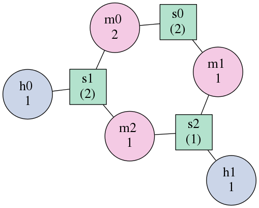

.. _forgi_graph_tutorial:

RNA Secondary Structure as a Graph Using the forgi Library
==========================================================

Introduction
------------

forgi is a library for manipulating RNA as a graph-like
structure. It provides classes for reading, storing, manipulating and
outputting RNA structures. It classifies and stores RNA secondary
structure in a data structure that quickly allows one to determine
which elements are connected and which nucleotides they contain.

The secondary structure of an RNA molecule can be divided into
five different types of 'elements'. Each element is assigned a name that
can be used to refer to it and to determine its identity:

* **fiveprime:** The unpaired nucleotides at the 5' end of a molecule/ chain. Name always starts with 'f' (e.g. 'f0').
* **threeprime**: The unpaired nucleotides at the 3' end of a molecule/ chain. Name always start with 't' (e.g. 't0')
* **stem:** Regions of contiguous canonical Watson-Crick base-paired nucleotides.
            Always start with 's' (e.g., 's0', 's1', 's2', ...)
* **interior loop:** Bulged out nucleotides. Unpaird double stranded regions, flanked by stems on either side.
                     Always start with 'i' ('i0', 'i1', 'i2',...)
* **multiloop segment:** Single-stranded regions bewteen two stems. Always start with 'm'. ('m0', 'm1', 'm2'...)
                      In the current version of forgi, pseudo-knots and exterior loops segments between stems are treated as multiloop segments.
* **hairpin loop:** Always start with 'h'.

A Simple Example
----------------

The use of forgi is perhaps best illustrated with an
example.

Let's take an RNA sequence:

``CGCUUCAUAUAAUCCUAAUGAUAUGGUUUGGGAGUUUCUACCAAGAGCCUUAAACUCUUGAUUAUGAAGUG``

We can predict its secondary structure using one of a number of tools,
including the Vienna RNA Package's RNAfold program:

http://rna.tbi.univie.ac.at/cgi-bin/RNAWebSuite/RNAfold.cgi

This will return a minimum free energy structure which can be represented using
dot-bracket notation:

``(((((((((...((((((.........))))))........((((((.......))))))..)))))))))``

This notation corresponds to a structure containing the base pairs shown in the
following figure:

.. image:: 1y26_ss.png
    :width: 260
    :height: 260
    :align: center

Evident in this image are six structural elements.

 * 3 stems
 * 2 hairpin loops
 * 1 multiloop

The multiloop itself can be divided into three unpaired sections of
nucleotides. Each of these elements is connected to certain other elements. For
example, the stem at the top is connected to two unpaired regions of the
multi-loop. Both of the hairpin loops are connected to one stem each. If we
abstract away the sequence information, we can imagine the structure as being
represented by a graph.

The forgi package can be used to do just this using the `rnaConvert.py` script::

    $ python examples/rnaConvert.py examples/input/1y26_ss.dotbracket -T forgi
    name untitled
    length 71
    define m2 34 41
    define h1 48 54
    define s2 42 47 55 60
    define s1 13 18 28 33
    define s0 1 9 63 71
    define m1 10 12
    define h0 19 27
    define m0 61 62
    connect s2 h1 m0 m2
    connect s1 h0 m1 m2
    connect s0 m1 m0

The define section contain one secondary structure element per line.
The numbers indicate the nucleotides that are
present in each element. So the stem s0 is composed of nucleotides 1 to 9 on
one strand and 63 to 71 on the other. The other elements are described in a
similar manner. The hairpin *h0* includes the nucleotides 19 to 27.

In this case it is difficult to picture which section is which from the text
representation. To make it easier, we will generate a file
readable by graphviz. The *neato* program can take that as input and create a
nice visualization of the graph::

    python examples/rnaConvert.py examples/input/1y26_ss.dotbracket -T neato | neato -Tpng -o 1y26_neato.png

The result is the following graph representation of the structure.

.. image:: 1y26_neato.png
    :width: 200
    :height: 200
    :align: center

Here square nodes represent stems and round nodes represent other elements.
The connections in this representation do not contain any nucleotides,
but simply illustrate which coarse grained elements are connected to each other.

The label of the nodes are the element names (as described above), so "s0" means stem number 0.
The numbers in parenthesis below the element names represent the number of nucleotides in the element.
In case of interior loops (not shown in this example), there can be two numbers, if the RNA has
unpaired nucleotides on both sides of the bulge.

Notice the similarity to the original base paired image? The top stem can be
identified as *s0*. The two hairpin loops are *h0* and *h1*. The regions in the
multiloop are given their own names.

This graph visualization is useful to get an idea of the coarse grained representation
of the RNA introduced by forgi. However, some information is lost in this picture:
This graph only shows, which stem is connected to which bulge, but it does not show which
side of the stem and bulge is involved in the connection.

Getting a Condensed Representation of the Element Types
^^^^^^^^^^^^^^^^^^^^^^^^^^^^^^^^^^^^^^^^^^^^^^^^^^^^^^^

Mapping nucleotide positions to secondary structure element types (stems,
hairpins, multiloops) is easily done using an example script::

    $ python examples/rnaConvert.py examples/input/1y26_ss.dotbracket -T element_string
    (((((((((...((((((.........))))))........((((((.......))))))..)))))))))
    sssssssssmmmsssssshhhhhhhhhssssssmmmmmmmmsssssshhhhhhhssssssmmsssssssss

In this example, one can clearly see that the paired regions are stems. Some
multiloops are present as well as two hairpin regions.

Another Example
^^^^^^^^^^^^^^^
Here's an example with a longer sequence.

Let's take an RNA sequence:

``GAAUUGCGGGAAAGGGGUCAACAGCCGUUCAGUACCAAGUCUCAGGGGAAACUUUGAGAUGGCCUUGCAAAGGGUAUGGUAAUAAGCUGACGGACAUGGUCCUAACCACGCAGCCAAGUCCUAAGUCAACAGAUCUUCUGUUGAUAUGGAUGCAGUUC``

With a secondary structure:

``....((((((....((.......((((.((((.(((...(((((..........)))))...((.......))....)))......))))))))......))...)).))))......(((....((((((((...))))))))...)))........``

Which looks like this:

.. image:: 1gid_ss.png
    :width: 360
    :height: 360
    :align: center

Can be transformed using the command:

``python examples/rnaConvert.py -T neato examples/input/1gid_ss.dotbracket | neato -Tpng -o 1gid_neato.png``

Into a graph that looks like this:

.. image:: 1gid_neato.png
    :width: 500
    :height: 500
    :align: center

Note that the graph and the secondary structure representation are oriented
differently. The multiloop at the top of the graph is at the bottom of the
secondary structure. Furthermore, some of the small bulges clearly visible in
the graph (as yellow nodes) are hard to see in the secondary structure although
they are indeed present.

Loading Structures
------------------

There are a number of ways to represent an RNA secondary structure and forgi
can read many of them using factory-classmethods of the `BulgeGraph` object
or its subclass, the `CoarseGrainedRNA` object.

As a high-level alternative, there is the `load_rna` factory function found in
`forgi.utilities.commandline_utils`. It automatically detects the filetype of the
input file, calls the correct constructor and returns a list of CoarseGrainRNA objects.

Loading a Structure from a Dot-Bracket String
^^^^^^^^^^^^^^^^^^^^^^^^^^^^^^^^^^^^^^^^^^^^^

A pseudoknot-free secondary structure can be represented a sequence of dots and
brackets where the dots represent unpaired bases and the matching brackets
represent base pairs. This representation is often delivered as the output of
secondary structure prediction tools such as `RNAfold`_ and `Mfold`_. It can
also be used as input to create a skeleton graph in `forgi`::

    >>> import forgi.graph.bulge_graph as fgb
    >>> bg = fgb.BulgeGraph.from_dotbracket('((..))..((..))')
    >>> print bg.to_bg_string()
    name untitled
    length 14
    seq_ids
    define h1 11 12
    define s1 9 10 13 14
    define s0 1 2 5 6
    define m0 7 8
    define h0 3 4
    connect s1 h1 m0
    connect s0 h0 m0

.. _RNAfold: http://rna.tbi.univie.ac.at/cgi-bin/RNAfold.cgi
.. _mFold: http://mfold.rna.albany.edu/?q=mfold

Loading a Structure from a BPSEQ Formatted File:
^^^^^^^^^^^^^^^^^^^^^^^^^^^^^^^^^^^^^^^^^^^^^^^^

A bpseq-formatted file stores the sequence and base-pair content of an RNA
secondary structure using one line for each nucleotide in the sequence. Each
line has three columns, the index of the nucleotide being described, it's
identity (A, C, G, or U) and the index of its pairing partner (0 if none). We
can load this file and create graph structure from it using the
`from_bpseq_str` function::

    >>> import forgi.graph.bulge_graph as fgb
    >>> bpstr="""1 A 0
    ... 2 A 12
    ... 3 A 11
    ... 4 A 9
    ... 5 A 8
    ... 6 A 0
    ... 7 A 0
    ... 8 A 5
    ... 9 A 4
    ... 10 A 0
    ... 11 A 3
    ... 12 A 2
    ... 13 A 0
    ... 14 A 0
    ... 15 A 20
    ... 16 A 19
    ... 17 A 0
    ... 18 A 0
    ... 19 A 16
    ... 20 A 15
    ... 21 A 0
    ... """
    >>> bg = fbg.BulgeGraph.from_bpseq_str(bpstr)
    >>> print bg.to_bg_string()
    name untitled
    length 21
    seq AAAAAAAAAAAAAAAAAAAAA
    seq_ids
    define f1 1 1
    define i0 10 10
    define h1 17 18
    define s2 15 16 19 20
    define s1 4 5 8 9
    define s0 2 3 11 12
    define t1 21 21
    define h0 6 7
    define m0 13 14
    connect s2 h1 m0 t1
    connect s1 i0 h0
    connect s0 f1 m0 i0

Loading a Structure from a Fasta File
^^^^^^^^^^^^^^^^^^^^^^^^^^^^^^^^^^^^^

A fasta file containing an id, a sequence and a secondary structure in
dot-bracket notation can be used to create a BulgeGraph structure::

    >>> import forgi.graph.bulge_graph as fgb
    >>> bg = fgb.BulgeGraph.from_fasta_text(""">blah
    ... AAAACCGGGCCUUUUACCCCAAAUUGGAA
    ... ((((..(((..)))..))))...((..))
    ... """)
    >>> print bg.to_bg_string()
    name blah
    length 29
    seq AAAACCGGGCCUUUUACCCCAAAUUGGAA
    seq_ids
    define s0 1 4 17 20
    define i0 5 6 15 16
    define s1 7 9 12 14
    define h0 10 11
    define m0 21 23
    define s2 24 25 28 29
    define h1 26 27
    connect s2 h1 m0
    connect s1 i0 h0
    connect s0 i0 m0

Using the load_rna factory function
^^^^^^^^^^^^^^^^^^^^^^^^^^^^^^^^^^^

If you prefer writing high-level code or if you are unsure about the format of the input file,
you should use the `load_rna` factory function from the `forgi.utilities.commandline_utils` module,
or - if integration with the argparse module is desired - the `cgs_from_args` function::

    >>> import forgi.utilities.commanline_utils as fuc
    >>> rnas = fuc.load_rna("examples/input/1y26.fx")
    >>> for rna in rnas:
    >>>     print(rna.name, rna.seq_length)
    1y26 71

Querying the Secondary Structure
--------------------------------

Finding the Partner of a Base Pair
^^^^^^^^^^^^^^^^^^^^^^^^^^^^^^^^^^

Consider the situation where we have a secondary structure and we want to know
the base-pairing partner of nucleotide *n*. This is easily done with forgi::

    >>> import forgi.graph.bulge_graph as fgb
    >>> bg = fgb.BulgeGraph()
    >>> bg.from_dotbracket('(((((((((...((((((.........))))))........((((((.......))))))..)))))))))')
    >>> bg.pairing_partner(1)
    71
    >>> bg.pairing_partner(13)
    33

Extracting a Pair Table
^^^^^^^^^^^^^^^^^^^^^^^

We can obtain a pair table describing the pairing pattern of the nucleotides in
this molecule. The first element of the pair table always contains the number
of nucleotides in the secondary structure. Every subsequent element **i**
either contains the number 0, indicating the nucleotide **i** is unpaired or an
integer **j** which is the pairing partner of **i**::

    >>> import forgi.graph.bulge_graph as cgb
    >>> bg = cgb.BulgeGraph()
    >>> bg.from_dotbracket('(((((((((...((((((.........))))))........((((((.......))))))..)))))))))')
    >>> bg.to_pair_table()
    [71, 71, 70, 69, 68, 67, 66, 65, 64, 63, 0, 0, 0, 33, 32, 31, 30, 29, 28, 0, 0, 0, 0, 0, 0, 0, 0, 0, 18, 17, 16, 15, 14, 13, 0, 0, 0, 0, 0, 0, 0, 0, 60, 59, 58, 57, 56, 55, 0, 0, 0, 0, 0, 0, 0, 47, 46, 45, 44, 43, 42, 0, 0, 9, 8, 7, 6, 5, 4, 3, 2, 1]

Getting the Name of an Element from the Residue Number
^^^^^^^^^^^^^^^^^^^^^^^^^^^^^^^^^^^^^^^^^^^^^^^^^^^^^^

Various applictions of ``forgi`` require knowledge of the internal name
of a particular element. As these names are generated by ``forgi`` itself, it's
useful to be to retrieve the name of an element given the number of a
residue which is part of it. To demonstrate how to do this we will first need
to load a secondary structure::

    >>> import forgi.graph.bulge_graph as fgb
    >>> bg = fgb.BulgeGraph(dotbracket_str='((..))..((..))')
    >>> print bg.to_bg_string()
    name untitled
    length 14
    seq_ids
    define s0 1 2 5 6
    define h0 3 4
    define m0 7 8
    define s1 9 10 13 14
    define h1 11 12
    connect s1 h1 m0
    connect s0 h0 m0

Then we can simply query for the element name based on the residue number::

    >>> bg.get_node_from_residue_num(1)
    's0'
    >>> bg.get_node_from_residue_num(3)
    'h0'
    >>> bg.get_node_from_residue_num(9)
    's1'

This can then be used to in other applications such as :ref:`loop-dimensions`,
:ref:`dissolving-stems`, :ref:`iloop-iterating`, etc...

Finding the Length of the Longest Stem
~~~~~~~~~~~~~~~~~~~~~~~~~~~~~~~~~~~~~~

For whatever reason, one may be interested in finding out how long the longest
stem in a secondary structure is. Initially, one may assume that this can
easily be done by searching for the longest string of '(' or ')' in the
dot-bracket file. Unfortunately, structures with an interior loop which has an
unpaired base on only one strand will lead to an erronous result in this
example. The decomposition provided by forgi will, however, take this into
account in enumerating the structural elements. It then becomes a matter of
iterating over the stems and checking their lengths::

    bg = cgb.BulgeGraph()
    bg.from_dotbracket(brackets)
    biggest_stem = (-1, 'x')
    for s in bg.stem_iterator():
        if bg.stem_length(s) > biggest_stem[0]:
            biggest_stem = (bg.stem_length(s), s)

Note that the dotbracket string `..((((..))))..` has one stem of length 4, while
the dotbracket string `..((((..).)))..` has two stems of length 3 and 1. \
Thus the longest stem in the second example is only 3 nucleotides long.

Getting the Sequence of an Element and its Neighbors
^^^^^^^^^^^^^^^^^^^^^^^^^^^^^^^^^^^^^^^^^^^^^^^^^^^^

Suppose we want to find out not only the sequence of an element, but also the
elements that surround it? This is easily done using the
`get_flanking_sequence` function. To illustrate, let's create a graph from a
fasta representation::

    import forgi.graph.bulge_graph as fgb

    bg = fgb.BulgeGraph()

    fa = """>blah
    AAAACCGGGCCUUUUACCCCAAAUUGGAA
    ((((..(((..)))..))))...((..))
    """
    bg.from_fasta(fa)

From the structure, we can see that there are two hairpins (`h0` and `h1`), one
interior loop (`i0`) and one multiloop (`m0`). We can get the sequence for `h0`
and it's neighboring node (`s0`) like so::

    >>> bg.get_flanking_sequence('h0')
    'GGGCCUUU'

The same can be done for the multiloop (`m0`)::

    >>> bg.get_flanking_sequence('m0')
    'CCCCAAAUU'

The interior loop is a little more tricky because it is double stranded. From
the interior loop, we need to pass in a parameter indicating which side we want
(0 or 1). The 0'th strand corresponds to the one with the lower numbered
nucleotides, whereas the 1'st strand is the other. The default is the 0'th
strand::

    >>> bg.get_flanking_sequence('i0')
    'AAAACCGGG'
    >>> bg.get_flanking_sequence('i0', side=1)
    'UUUUACCCC'

.. _loop-dimensions:

Retrieving the Dimensions of a Loop
^^^^^^^^^^^^^^^^^^^^^^^^^^^^^^^^^^^

Each loop can be said to have a size or dimension. For interior loops, the
dimensions take the form of a tuple and indicate how many unpaired nucleotides
are on each side. For multiloops each segment is represented individually and
thus should have only one dimension (how many unpaired nucleotides are in that
segment), but in order to maintain consistency with interior loops, we make it
a tuple by attaching 1000 as the second value::

    >>> import forgi.graph.bulge_graph as fgb
    >>> bg = fgb.BulgeGraph(dotbracket_str='((.(.))..((..)))')
    >>> bg.get_bulge_dimensions('i0')
    (1, 0)
    >>> bg.get_bulge_dimensions('m0')
    (0, 1000)
    >>> bg.get_bulge_dimensions('m1')
    (0, 1000)
    >>> bg.get_bulge_dimensions('m2')
    (2, 1000)

.. _dissolving-stems:

Removing basepairs and dissolving Stems
^^^^^^^^^^^^^^^^^^^^^^^^^^^^^^^^^^^^^^^

Basepairs be removed from the skeleton graph using the `remove_base_pairs`
memberfunction::

    >>> import forgi.graph.bulge_graph as fgb
    >>> bg = fgb.BulgeGraph(dotbracket_str='((..))..((..))')
    >>> bg.remove_base_pairs([(1,6), (9,14)])
    >>> print bg.to_dotbracket_string()
    .(..)....(..).

To remove a whole stem, use the `stem_bp_iterator` member function::

    >>> import forgi.graph.bulge_graph as fgb
    >>> bg = fgb.BulgeGraph(dotbracket_str='((..))..((..))')
    >>> bg.remove_base_pairs(list(bg.stem_bp_iterator("s0")))
    >>> print bg.to_dotbracket_string()
    .(..)....(..).

Note::

    In forgi 1.0, you have to explicitly convert the iterator to
    a list. In future versions, this conversion will be done automatically by
    `remove_base_pairsremove_base_pairs`.

Finding Out Which Side of a Stem a Loop Is On
^^^^^^^^^^^^^^^^^^^^^^^^^^^^^^^^^^^^^^^^^^^^^

If one imagines a stem as having a direction where its start is the position of
the lowest numbered nucleotide within it, then a loop adjacent to the stem will
be on one side of it. Which side it's on can be elucidated using the
``get_sides`` function::

    >>> import forgi.graph.bulge_graph as fgb
    >>> bg = fgb.BulgeGraph(dotbracket_str="..((..((..))..))..")
    >>> bg.get_sides('s0', 'i0')
    (1, 0)
    >>> bg.get_sides('s1', 'i0')
    (0, 1)

The result shows that the loop `i0` is on side 1 of stem `s0` and side 0 of
stem `s1`. If `bg.get_sides(s,b)` return a tuple `(sb, se)`, where the nucleotides
in `bg.coords[sb]` are on the side of the loop.

Iteration
---------

forgi provides iterators for the various elements, and base pairing in the structure.

.. _iloop-iterating:

Iterating Over the Nucleotides of an Interior Loop
^^^^^^^^^^^^^^^^^^^^^^^^^^^^^^^^^^^^^^^^^^^^^^^^^^

Imagine that we have a model of an RNA structure, and we want to list all of
the nucleotides which are in interior loop regions. This is can be done by
combining an iterator which yields all of the interior loops and another
iterator which iterates over the nucleotides within a particular element::

    >>> import sys
    >>> import forgi.graph.bulge_graph as cgb
    >>> bg = cgb.BulgeGraph()
    >>> bg.from_dotbracket("((..((..))..))..((..((..))..))")
    >>> for iloop in bg.iloop_iterator():
    ...     for rn in bg.define_residue_num_iterator(iloop):
    ...             sys.stdout.write(str(rn) + " ")
    ...
    10 11 12 13 2 3 4 5 26 27 28 29 18 19 20 21

Iterating Over The List of Elements
^^^^^^^^^^^^^^^^^^^^^^^^^^^^^^^^^^^

** Stems **

To iterate over each stem in the structure, use the `stem_iterator()` function::

    >>> import forgi.graph.bulge_graph as fgb
    >>> bg = fgb.BulgeGraph(dotbracket_str='((..((..))..))..((..((..))...)).')
    >>> print list(bg.stem_iterator())
    ['s3', 's2', 's1', 's0']

** Interior Loops **

To iterate over each interior loop in the structures, use the `iloop_iterator()`::

    >>> print list(bg.iloop_iterator())
    ['i1', 'i0']

** Others **

For multiloops, hairpin loops, fiveprime regions and threeprimes regions  use
`mloop_iterator()`, `hloop_iterator()`, `floop_iterator` and `tloop_iterator`,
respectively::

    >>> print list(bg.mloop_iterator())
    ['m0']
    >>> print list(bg.hloop_iterator())
    ['h1', 'h0']
    >>> print list(bg.floop_iterator())
    []
    >>> print list(bg.tloop_iterator())
    ['t1']

Notice that `floop_iterator()` doesn't yield any values. This is because there
is no 3' unpaired region in this structure.

Graph Functions
---------------

Finding the Minimum Spanning Tree of a Graph
^^^^^^^^^^^^^^^^^^^^^^^^^^^^^^^^^^^^^^^^^^^^

Can we create a subgraph such that all stems are connected and no cycles
remain? Recall that cycles only occur in multiloop sections (junctions). Can we
return a representation of the structure such that all stems are connected with
the least number of nucleotides between them? If interior loops and multiloop
segements were considered edges, then this would be the equivalent of a minimum
spanning tree. Since they are nodes, then the result is not a minimum spanning
tree but simply a representation of the secondary structure with broken
multiloops.

As an example, consider the following structure:

.. python examples/graph_to_neato.py -c "((..((.)).(.).))" | neato -Tpng -o doc/mst_init.png

To break the cycle, we would like to remove the segment 'm0'. This is easily
done using the `get_mst()` function of the `BulgeGraph` data structure::

    >>> import forgi.graph.bulge_graph as fgb
    >>> bg = fgb.BulgeGraph(dotbracket_str="((..((.)).(.).))")
    >>> bg.get_mst()
    set(['s2', 's1', 's0', 'm1', 'm2'])

The result contains all the nodes except the ones removed to break the cycles.
The implementation uses a slightly modified version of Kruskal's algorithm.

Traversing the Graph
^^^^^^^^^^^^^^^^^^^^

We can traverse all of the loops in a graph in breadth-first manner using the
`traverse_graph` function::

    >>> import forgi.graph.bulge_graph as fgb
    >>> bg = fgb.BulgeGraph(dotbracket_str='(.(.(.(.).(.).).(.).))')
    >>> bg.traverse_graph()
    [('s0', 'i0', 's1'), ('s1', 'm1', 's5'), ('s5', 'm4', 's2'), ('s2', 'm3', 's4'), ('s4', 'm5', 's3')]

Starting with the first stem, *s0*, we visit each loop that connects it to
another stem and return all the visited loops as a list of tuples. Each tuple
has the following three elements: (from_stem, loop, to_stem).

Finding the elements which form the multiloops of a structure
^^^^^^^^^^^^^^^^^^^^^^^^^^^^^^^^^^^^^^^^^^^^^^^^^^^^^^^^^^^^^

The `find_multiloop_loops()` function returns a list of sets where each set
contains the elements that are part of a particular junction.

.. image:: find_loops.png
    :width: 290
    :align: center

.. python examples/graph_to_neato.py -c "(.(.(.(.).(.).).(.).))" | neato -Tpng -o doc/mst_init.png

Example::

    >>> import forgi.graph.bulge_graph as fgb
    >>> bg = fgb.BulgeGraph(dotbracket_str='(.(.(.(.).(.).).(.).))')
    >>> print bg.find_multiloop_loops()
    [set(['s3', 's2', 's4', 'm5', 'm3', 'm2']), set(['s2', 's1', 's5', 'm4', 'm1', 'm0'])]

Calculating the Minimum Secondary Structure Distance Between Two Elements
~~~~~~~~~~~~~~~~~~~~~~~~~~~~~~~~~~~~~~~~~~~~~~~~~~~~~~~~~~~~~~~~~~~~~~~~~

The secondary structure distance, in our case, will be calculated as the
distance along the backbone or along base-pair links. When calculated between
two elements, it is the minimum distance between any two pairs of nucleotides
in each of the two elements.

Consider the following example::

    >>> bg = fgb.BulgeGraph(dotbracket_str='((..))..((..))((..))')
    >>> bg.ss_distance('s0', 's1')
    3
    >>> bg.ss_distance('s0', 's2')
    5
    >>> bg.ss_distance('s0', 'h2')
    7

The first distance requires going over three backbone edges. The second distance
Requires three backbone, one base pair, and one more backbone. The last distance
requires three backbone, one base pair, and three more backbone links.

Applications
------------

Rosetta rna_denovo Constraint File Creation
^^^^^^^^^^^^^^^^^^^^^^^^^^^^^^^^^^^^^^^^^^^

The `Rosetta <http://www.rosettacommons.org/>`_ protein structure prediction
package provides a program for RNA 3D structure prediction called `rna_denovo
<http://www.rosettacommons.org/manuals/rosetta3.3_user_guide/d2/d82/rna_denovo.html>`_.
To specify the secondary structure of an RNA molecule, one needs to pass in a
parameter file indicating which nucleotides are paired.

Given an dot-bracket sequence as input, forgi can be easily be used to generate
the parameter file for rna_denovo.Using the secondary structure of 1y26 (shown
in the first example) one can run the appropriate example:

``python examples/dotbracket_to_rosetta_constraints.py examples/1y26_ss.dotbracket``

And get an appropriately formatted parameter file::

    STEM PAIR 42 60
    STEM PAIR 43 59
    STEM PAIR 44 58
    STEM PAIR 45 57
    STEM PAIR 46 56
    STEM PAIR 47 55
    STEM PAIR 13 33
    STEM PAIR 14 32
    STEM PAIR 15 31
    STEM PAIR 16 30
    STEM PAIR 17 29
    STEM PAIR 18 28
    STEM PAIR 19 27
    STEM PAIR 1 71
    STEM PAIR 2 70
    STEM PAIR 3 69
    STEM PAIR 4 68
    STEM PAIR 5 67
    STEM PAIR 6 66
    STEM PAIR 7 65
    STEM PAIR 8 64
    STEM PAIR 9 63
