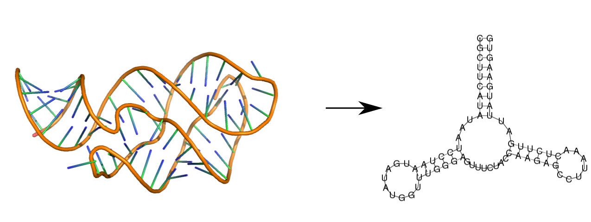
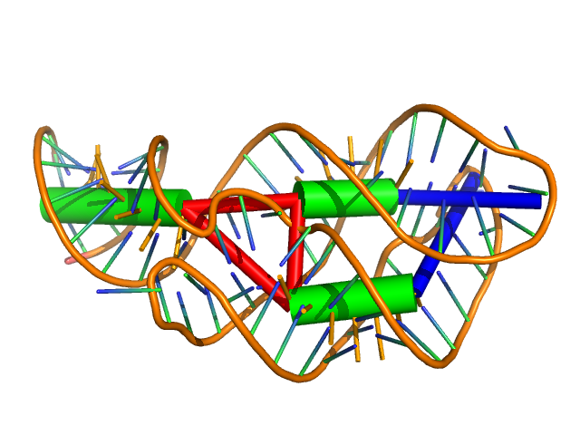

.. _forgi_threedee_tutorial:

RNA 3D Structure Using forgi.threedee
=====================================

Introduction
~~~~~~~~~~~~
``forgi.threedee`` is an extension of ``forgi`` capable of handling 3D data
about RNA structures. It provides methods for extracting secondary structure as
well as creating a coarse grain representation of 3D RNA structures.

Requirements
~~~~~~~~~~~~

MC_Annotate_ is required for annotating the nucleotide interactions.

.. _MC_Annotate: http://www.major.iric.ca/MajorLabEn/MC-Tools.html

Extracting 2D structure from a 3D structure
~~~~~~~~~~~~~~~~~~~~~~~~~~~~~~~~~~~~~~~~~~~

To extract the base-pair information from a 3D structure stored in a PDB file,
use the `pdb_to_ss_fasta.py` script. By default, this script operates on the
largest RNA chain in the provided pdb file (although a specific chain can be
specified using the `-c` option).::

    [pete@kat forgi]$ python examples/pdb_to_ss_fasta.py examples/1y26.pdb 
    >1y26
    CGCUUCAUAUAAUCCUAAUGAUAUGGUUUGGGAGUUUCUACCAAGAGCCUUAAACUCUUGAUUAUGAAGUG
    (((((((((...(((((((.......)))))))........((((((.......))))))..)))))))))

This can also be done programmatically in python::

    >>> import forgi.threedee.model.coarse_grain as ftmc
    >>> cg = ftmc.from_pdb('test/forgi/threedee/data/1y26.pdb')
    >>> print cg.to_fasta_string()
    >1y26_X
    CGCUUCAUAUAAUCCUAAUGAUAUGGUUUGGGAGUUUCUACCAAGAGCCUUAAACUCUUGAUUAUGAAGUG
    ((((((((((..((((((.........))))))......).((((((.......))))))..)))))))))

The reported 2D structure is extracted from the annotations of MC-Annotate [1].
Pseudoknots are removed using the knotted2nested.py script which is included
with the generous permition of Dr. Sandra Smit [2]. Users making use of the
3D-to-2D facilities of the ``forgi.threedee`` package should cite the articles
listed in the citations section at the bottom of this page.

Creating a Coarse Grain 3D Representation of an RNA Molecule
~~~~~~~~~~~~~~~~~~~~~~~~~~~~~~~~~~~~~~~~~~~~~~~~~~~~~~~~~~~~

One can imagine an RNA molecule as a collection of helices and ... not helices
(hairpins, interior loops, multiloops, etc..) as described in the
:ref:`forgi_graph_tutorial`. By creating an abstraction for the canonical
helixes and representing them as cylinders, we can create a coarse grain
representaiton of the RNA molecule::

    [pkerp@plastilin forgi]$ python examples/pdb_to_cg.py ~/projects/ernwin/fess/structures/2l94.pdb 
    name 2l94
    length 45
    seq GGGAAGAUCUGGCCUUCCCACAAGGGAAGGCCAGGGAAUCUUCCC
    define f1 0 1
    define i0 34 38 8 9
    define s1 9 19 24 34
    define s0 1 8 38 45
    define t1 45 46
    define h0 19 24
    connect s1 i0 h0
    connect s0 f1 i0 t1
    coord i0 -3.16011516235 3.53600076719 3.59573158587 -10.6370223437 3.13588043498 -0.447155058784
    coord s1 -3.16011516235 3.53600076719 3.59573158587 21.5002000702 -2.08161219996 0.501285407577
    coord s0 -25.7014473529 -5.72949740183 -4.01197045617 -10.6370223437 3.13588043498 -0.447155058784
    coord h0 21.5002000702 -2.08161219996 0.501285407577 23.5599994659 6.76999998093 -5.87900018692
    twist s1 -0.00919853915562 0.451186349593 -0.892382353489 -0.153976361554 -0.136900113113 -0.978544653612
    twist s0 -0.532923452202 0.816983142634 0.220297840992 0.430691441325 -0.408188889295 -0.804914102887

The lines beginning with `coord` indicate the positions of the helices. They
are calculated by fitting a cylinder to each helical region of the 3D
structure.

Visualizing the Coarse Grain Helical Representation
~~~~~~~~~~~~~~~~~~~~~~~~~~~~~~~~~~~~~~~~~~~~~~~~~~~

The coarse grain representation shown in the prior example can be visualized
using Pymol_ and the ``visualize_pdb.py`` script. The green cylinders below
represent canonical helical regions, red represent multiloops and blue -
hairpin loops::

    python examples/visualize_pdb.py ~/projects/ernwin/fess/structures/1y26.pdb

.. _Pymol: http://www.pymol.org/

To visualize just the coarse-grain representation one can use ``visualize_cg.py`` script::

    python examples/visualize_cg.py examples/1y26.cg

.. image:: 1y26_coarse.png
    :width: 270
    :align: center

Get A Description of a Coarse-Grain Stem
~~~~~~~~~~~~~~~~~~~~~~~~~~~~~~~~~~~~~~~~

The ``get_stem_stats`` function returns a ``forgi.threedee.model.StemStat``
structure which contains information about a stem, such as how many base pairs
it has, how long it is (in Å) and how much its helix twists from the
start to the end. It also stores information about which nucleotides it is
composed of (its `define`). 

Using the structure 2MIS as an example::

    >>> import forgi.threedee.model.coarse_grain as ftmc
    >>> cg = ftmc.from_pdb('test/forgi/threedee/data/2mis.pdb', intermediate_file_dir='tmp')
    >>> print cg.get_stem_stats('s0')
    pdb_name: 2mis_A bp_length: 6 phys_length: 14.735000 twist_angle: 2.822735 define: 1 6 21 26

The first stem in the structure ('s0'), is composed of nucleotides 1 - 6 and 21
- 26, has a length of 14.735 Angstroms and a twist of 2.82 radians. It contains
6 base pairs and comes from a structure named `2mis_A`.

Get A Description of an Angle Between Two Stems
~~~~~~~~~~~~~~~~~~~~~~~~~~~~~~~~~~~~~~~~~~~~~~~

The orientation of one helix (:math:`s_1`) with respect to another (:math:`s_2`), :math:`O(s_1,
s_2)`, can be represented by six parameters: 

1. :math:`r, \phi_d, \psi_d` which describe the location of the of the start of 
   s2 relative to the end of s_1

2. :math:`\phi_o, \psi_o`, which describe the direction of the axis vector of s2

3. :math:`t`, which describes how much s2 is twisted relative to s_1

Using these six parameters, one can reproduce the position of a second helix
given the position of the first. The ``get_bulge_angle_stats`` function returns
this set of parameters for any secondary structure element which connects two
stems (hereafter referred to as a 'joint' and 'i0' in the example below)::

    >>> import forgi.threedee.model.coarse_grain as ftmc
    >>> cg = ftmc.from_pdb('test/forgi/threedee/data/2mis.pdb', intermediate_file_dir='tmp')
    >>> print cg.get_bulge_angle_stats('i0')
    (<forgi.threedee.model.stats.AngleStat instance at 0x226e098>, <forgi.threedee.model.stats.AngleStat instance at 0x226e200>)
    >>> print cg.get_bulge_angle_stats('i0')[0]
    angle 2mis_A 3 1 1.422985 -0.124293 0.828886 6.720167 1.313748 -0.401573 7 9 20 20 GCAGC GAC
    >>> print cg.get_bulge_angle_stats('i0')[1]
    angle 2mis_A 3 1 1.762096 0.024409 0.822014 6.720167 1.294799 0.098387 7 9 20 20 GCAGC GAC

The ``get_bulge_angle_stats`` function actually returns two sets of parameters,
one for each orientation (:math:`O(s_1, s_2)` and :math:`O(s_2, s_1)`). 

The values stored by an ``AngleStat`` are the six parameters listed above as well
as the name of the pdb file the coarse grain model represents, the size of the
joint and the sequence of its two strands (including the nucleotides in the
Watson-crick base pairs which flank it).

Iterate over Long Range Interactions
~~~~~~~~~~~~~~~~~~~~~~~~~~~~~~~~~~~~

>>> import forgi.threedee.model.coarse_grain as ftmc
>>> cg = ftmc.CoarseGrainRNA('test/forgi/threedee/data/1GID_A.cg')
>>> list(cg.longrange_iterator())
[('h0', 's9'), ('i7', 's9'), ('i0', 't1'), ('h0', 'i7'), ('h0', 'i6'), ('h1', 'i4'), ('i4', 's1'), ('i4', 'm3'), ('i6', 'i7'), ('s1', 't1')]

Calculate the Distance Between Two Coarse-Grain Elements
~~~~~~~~~~~~~~~~~~~~~~~~~~~~~~~~~~~~~~~~~~~~~~~~~~~~~~~~

>>> import forgi.threedee.model.coarse_grain as ftmc
>>> cg = ftmc.CoarseGrainRNA('test/forgi/threedee/data/1y26.cg')
>>> dist = cg.element_physical_distance('h0', 'h1')
>>> print dist
7.87989954482

Find out How Much an Interior Loop Bends a Stem
~~~~~~~~~~~~~~~~~~~~~~~~~~~~~~~~~~~~~~~~~~~~~~~

Interior loops often place kinks in long stem-like structures. This leads
to a change in the base stacking pattern and can indicate functional
relevance. To extract this information for a given PDB file, we need to
iterate over each interior loop and calculate the angle between the two
stems it connects::

    >>> import forgi.threedee.model.coarse_grain as ftmc
    >>> import forgi.threedee.utilities.vector as ftuv
    >>> cg = ftmc.from_pdb('test/forgi/threedee/data/1GID_native.pdb')
    >>> for iloop in cg.iloop_iterator():
    ...     conn = cg.connections(iloop)
    ...     # conn contains two values ['s0', 's1']
    ...     angle = ftuv.vec_angle(cg.coords[conn[0]][1] - cg.coords[conn[0]][0], cg.coords[conn[1]][1] - cg.coords[conn[1]][0]) 
    ...     print iloop, angle
    ... 
    i3 0.307770762476
    i2 2.74681004918
    i1 0.1697963999
    i0 0.491755788011
    i5 0.456253974086
    i4 0.261428615896
    i7 0.15810445353
    i6 0.510919193909

`conn[0]` and `conn[1]` are the identifiers of the first and second connected stems,
respectively, while `cg.coords[conn[0]][0]` contains the coordinates of the front end
of the first stem. Subtracting the coordinates of one end of the stem from the 
other gives us a vector which is used to calculate an angle.
This example, using the Group-I intron,
indicates the presence of a kink-turn at interior loop `i2`.

Get the Largest RNA Chain from a PDB File
~~~~~~~~~~~~~~~~~~~~~~~~~~~~~~~~~~~~~~~~~

``forgi`` includes some utility functions for PDB files, one of which returns
the largest chain in the pdb file which is an RNA molecule. This can be useful
for rapidly visualizing a PDB file which contains both RNA and proteins without
having to see which chain is the RNA molecule. Of course for any meaningful
analysis, one should know which chains are present along with their
identifiers. The return value for this function is a Bio.PDB.Chain.Chain
populated from the pdb file passed as an argument.

Example::

    import forgi.threedee.utilities.pdb as ftup
    >>> c = ftup.get_biggest_chain('test/forgi/threedee/data/1X8W.pdb')
    >>> print c
    <Chain id=B>

Check if a Bio.PDB Chain is RNA
~~~~~~~~~~~~~~~~~~~~~~~~~~~~~~~

Example::

    >>> import Bio
    >>> import forgi.threedee.utilities.pdb as ftup
    >>> import os.path as op
    >>> 
    >>> filename = op.expanduser('~/data/pdbs/1Y26.pdb')
    >>> structure = Bio.PDB.PDBParser().get_structure('blah', filename)
    >>> ftup.is_rna(list(structure.get_chains())[0])
    True

Calculate the RMSD Between two PDB Chains
~~~~~~~~~~~~~~~~~~~~~~~~~~~~~~~~~~~~~~~~~

The root mean square deviation (RMSD) is a measure of how much two molecules
differ in their atomic coordinates. The value, of course, depends on how the
two molecules are superimposed, but in most cases (including here) a rotation
is applied such that the RMSD is minimized. The RMSD value is often used to
compare the models created by structure prediction software to the real
structure, and can easily be calculated using the `pdb_rmsd` method. It can
take an optional `sidechains` parameter (which defaults to False), to indicate
that the sidechains (bases) should be included in the RMSD calculation. If it
is False, then only the backbone atoms are used in the calculation::

    >>> import forgi.threedee.utilities.pdb as ftup
    >>> import Bio.PDB as bpdb
    >>> c = list(bpdb.PDBParser().get_structure('temp', 'test/forgi/threedee/data/2mis.pdb').get_chains())[0]
    >>> ftup.pdb_rmsd(c, c)
    (180, 1.0314194769216807e-14, (array([[  1.00000000e+00,  -1.94289029e-16,   1.11022302e-16],
           [  8.32667268e-17,   1.00000000e+00,   6.93889390e-17],
                  [ -5.55111512e-17,   6.93889390e-17,   1.00000000e+00]]), array([ -5.68434189e-14,   2.84217094e-14,  -1.73194792e-14])))

The return value is a tuple containing the number of atoms that were
superimposed, the RMSD value and another tuple containing the optimal rotation
matrix and translation vector.

If loading the chains is too much work, there is a wrapper function which will
calculate the rmsd between the first chains of the first models of two pdb
files::

    >>> import forgi.threedee.utilities.pdb as ftup
    >>> ftup.pdb_file_rmsd('test/forgi/threedee/data/2mis.pdb', 'test/forgi/threedee/data/2mis.pdb')
    (180, 1.0314194769216807e-14, (array([[  1.00000000e+00,  -1.94289029e-16,   1.11022302e-16],
           [  8.32667268e-17,   1.00000000e+00,   6.93889390e-17],
                  [ -5.55111512e-17,   6.93889390e-17,   1.00000000e+00]]), array([ -5.68434189e-14,   2.84217094e-14,  -1.73194792e-14])))

Note that this function, unless provided with a chain identifier always takes the largest RNA chain in the file and omits any non-RNA residues.

Calculate the RMSD Between two Coarse-Grain Models
~~~~~~~~~~~~~~~~~~~~~~~~~~~~~~~~~~~~~~~~~~~~~~~~~~

Like PDB chains, we can also compute an RMSD value for two coarse grain models.
For this we need to use the virtual residues of the helices as the atoms and
compute the RMSD value amongst them::

    >>> import forgi.threedee.model.coarse_grain as ftmc
    >>> import forgi.threedee.utilities.graph_pdb as ftug
    >>> import forgi.threedee.utilities.rmsd as ftur
    >>> 
    >>> cg1 = ftmc.CoarseGrainRNA('test/forgi/threedee/data/1y26.cg')
    >>> cg2 = ftmc.CoarseGrainRNA('test/forgi/threedee/data/1y26.cg')
    >>> 
    >>> v1 = ftug.bg_virtual_residues(cg1)
    >>> v2 = ftug.bg_virtual_residues(cg2)
    >>> 
    >>> print ftur.rmsd(v1,v2)
    0.0

Scalar descriptors of RNA 3D strructures
~~~~~~~~~~~~~~~~~~~~~~~~~~~~~~~~~~~~~~~~

To characterize an RNA 3D structures, a lot of descriptors could be potentially useful.
The `forgi.threedee` library includes the following scalar descriptors.

    1) The Radius of gyration
    2) The anisotropy
    3) The asphericity

Note that 1-3 are related, as they could all be derived from the gyration tensor.
An overview over these properties can be found for example in the introduction of
of reference [3] and the papers referenced therein.

    >>> import forgi.threedee.model.coarse_grain as ftmc
    >>> import forgi.threedee.utilities.rmsd as ftur
    >>> 
    >>> cg = ftmc.CoarseGrainRNA('test/forgi/threedee/data/1y26.cg')
    >>>
    >>> print "Radius of Gyration", cg.radius_of_gyration()
    >>>
    >>> coords = cg.get_ordered_stem_poss() #Use only coarse grained coordinates of stems
    >>> coords = cg.get_ordered_virtual_residue_poss() #Alternatively use coordinates of virtual residues
    >>> 
    >>> print "Anisotropy", ftur.anisotropy(coords)
    >>> print "Asphericity", ftur.asphericity(coords)

Determine if two Atoms are Covalently Bonded
~~~~~~~~~~~~~~~~~~~~~~~~~~~~~~~~~~~~~~~~~~~~

The difference between covalently bonded and unbonded atoms needs to be taken
into account when calculating clash scores. Covalently bonded atoms can be
closer to each other in a real structure than unbonded atoms. Based on the
identity of the atoms and their parent nucleotides, the ``is_covalent``
function tries to determine the whether two atoms are covalently bonded.

Example::

    >>> import forgi.threedee.utilities.pdb as ftup
    >>> c = ftup.get_biggest_chain('test/forgi/threedee/data/2mis.pdb')
    >>> ftup.is_covalent([c[10]["C3'"], c[10]["C4'"]])
    True
    >>> ftup.is_covalent([c[10]["C3'"], c[10]["C5'"]])
    False

Citations
~~~~~~~~~

[1] *Gendron P, Lemieux S, Major F*. **Quantitative analysis of nucleic acid three-dimensional structures.** J Mol Biol (2001) 308:919–936.

[2] *Sandra Smit, Kristian Rother, Jaap Heringa, and Rob Knight*.
**From knotted to nested RNA structures: a variety of computational methods for pseudoknot removal.**
RNA (2008) 14(3):410-416.

[3] *Handan Arkın and Wolfhard Janke*. 
**Gyration tensor based analysis of the shapes of polymer chains in an attractive spherical cage**
The Journal of Chemical Physics (2013) 138:054904, http://dx.doi.org/10.1063/1.4788616

