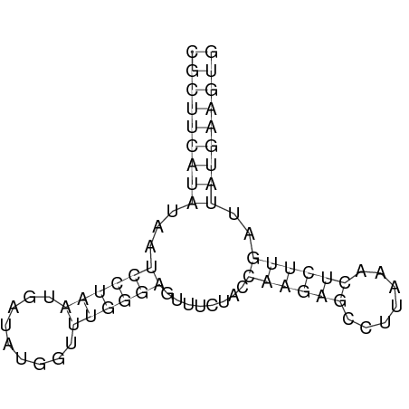
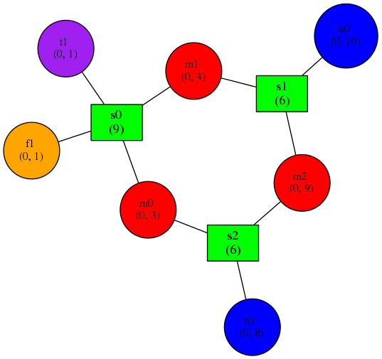
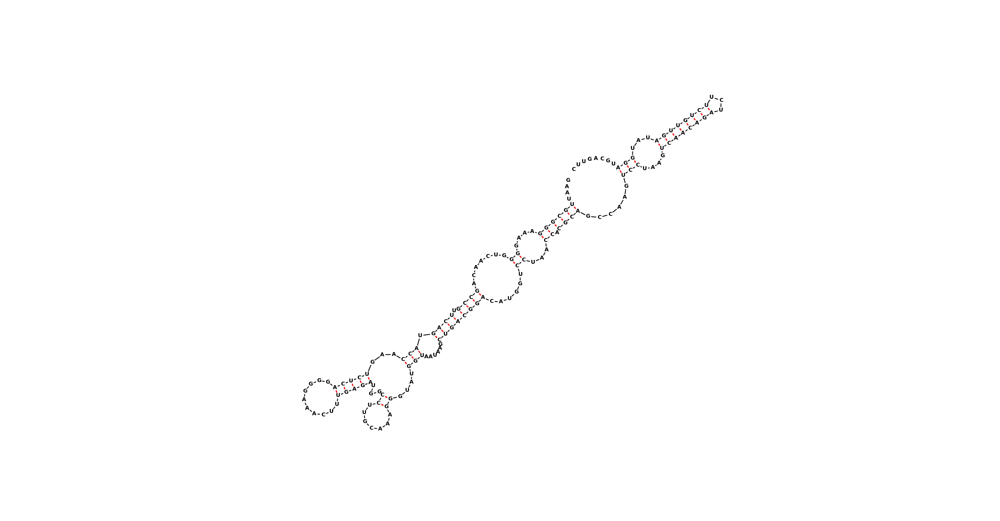
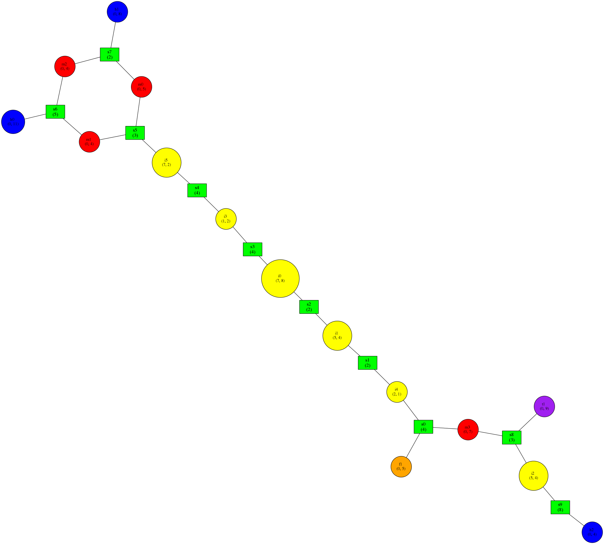

Tutorial
==============
A Simple Example
~~~~~~~~~~~~~~~~
Corgy is a library for manipulating RNA as a graph-like structure. It provides classes for reading, storing, manipulating and outputting RNA structures. It's use is perhaps best illustrated with an example.

Let's take an RNA sequence:

``CGCUUCAUAUAAUCCUAAUGAUAUGGUUUGGGAGUUUCUACCAAGAGCCUUAAACUCUUGAUUAUGAAGUG``

We can predict its secondary structure using one of a number of tools, including the Vienna RNA Package's RNAfold program:

http://rna.tbi.univie.ac.at/cgi-bin/RNAfold.cgi

This will return a minimum free energy structure which can be represented using dot-bracket notation:

``(((((((((...((((((.........))))))........((((((.......))))))..)))))))))``

This notation corresponds to a structure containing the base pairs shown in the following figure:

Evident in this image are six structural elements.

 * 3 stems
 * 2 hairpin loops
 * 1 multiloop

The multiloop itself can be divided into three unpaired sections of nucleotides. Each of these elements is connected to certain other elements. For example, the stem at the top is connected to two unpaired regions of the multi-loop. Both of the hairpin loops are connected one stem each. If we abstract away the sequence information, we can imagine the structure as being represented by a graph.

The corgy package can be used to do just this by using thedotbracket_to_bulge_graph.py script::

    [pkerp@plastilin corgy]$ python examples/dotbracket_to_bulge_graph.py examples/input/1y26_ss.dotbracket
    length 71
    define f1 0 1
    define h1 47 55
    define s2 42 47 55 60
    define s1 13 18 28 33
    define s0 1 9 63 71
    define t1 71 72
    define m1 9 13
    define h0 18 28
    define m2 33 42
    define m0 60 63
    connect s2 h1 m0 m2
    connect s1 h0 m1 m2
    connect s0 f1 m1 m0 t1

The result is an adjacency list of all the elements. The stems are defined with names starting with 's', hairpins with an 'h', multiloops with an 'm', interior loops with an 'i', five-prime unpaired regions with an 'f' and three-prime unpaired regions with a 't'. The numbers indicate indicate the nucleotides that are present in each element. So the stem s0 is composed of nucleotides 1 to 9 on one strand and 63 to 71 on the other. For non-stem elements, the nucleotides listed in the define statements above actually extend one beyond the edges of the elements. This means that, for example, the hairpin *h0* includs the nucleotides 19 to 27, instead of 18 to 28. This difference is an artifact of the implementation and used for some internal computations. It also makes it easier to represent interior loops which only have a bulge on one strand.

In this case it is difficult to picture which section is which from the text representation. To make it easier, another example script will generate a file readable by graphviz. The *neato* program can take that as input and create a nice visualization of the graph::

    [pkerp@plastilin corgy]$ python examples/graph_to_neato.py examples/input/1y26_ss.dotbracket | neato -Tpng -o 1y26_neato.png
    
The result is the following graph representation of the structure.

    
Notice the similarity to the original base paired image? The top stem can be identified as *s0*. The two hairpin loops are *b3* and *b1*. The regions in the multiloop are given their own names. The oddity is the presence of the *f1* and *t1* loops.

Getting a Condensed Representation of the Element Types
^^^^^^^^^^^^^^^^^^^^^^^^^^^^^^^^^^^^^^^^^^^^^^^^^^^^^^^
When one is interested in a mapping of each nucleotide to the element type within which it residues, a string representation can be generated using one of the example scripts::

    [pkerp@plastilin corgy]$ python examples/dotbracket_to_element_string.py -s examples/input/1y26_ss.dotbracket
    (((((((((...((((((.........))))))........((((((.......))))))..)))))))))
    sssssssssmmmsssssshhhhhhhhhssssssmmmmmmmmsssssshhhhhhhssssssmmsssssssss

In this example, one can clearly see that the paired regions are stems. Some multiloops are present as well as two hairpin regions. The -s option was used to print out the dotbracket representation as well as the element type representation. Omitting it will only output the latter line.

Another Example
~~~~~~~~~~~~~~~
Here's an example with a longer sequence.

Let's take an RNA sequence:

``GAAUUGCGGGAAAGGGGUCAACAGCCGUUCAGUACCAAGUCUCAGGGGAAACUUUGAGAUGGCCUUGCAAAGGGUAUGGUAAUAAGCUGACGGACAUGGUCCUAACCACGCAGCCAAGUCCUAAGUCAACAGAUCUUCUGUUGAUAUGGAUGCAGUUC``

With a secondary structure:

``....((((((....((.......((((.((((.(((...(((((..........)))))...((.......))....)))......))))))))......))...)).))))......(((....((((((((...))))))))...)))........``

Which looks like this:

Can be transformed using the command:

``python examples/graph_to_neato.py examples/input/1gid_ss.dotbracket | neato -Tpng -o 1gid_neato.png``

Into a graph that looks like this:

Note that the graph and the secondary structure representation are oriented differently. The multiloop at the top of the graph is at the bottom of the secondary structure. Furthermore, some of the small bulges clearly visible in the graph (as yellow nodes) are hard to see in the secondary structure although they are indeed present.

Finding the Length of the Longest Stem
~~~~~~~~~~~~~~~~~~~~~~~~~~~~~~~~~~~~~~

For whatever reason, one may be interested in finding out how long the longest stem in a secondary structure is. Initially, one may assume that this can easily be done by searching for the longest string of '(' or ')' in the dot-bracket file. Unfortunately, structures with an interior loop which has an unpaired base on only one strand will lead to an erronous result in this example. The decomposition provided by corgy will, however, take this into account in enumerating the structural elements. It then becomes a matter of iterating over the stems and checking their lengths::

    bg = cgb.BulgeGraph()
    bg.from_dotbracket(brackets)
    biggest_stem = (-1, 'x')
    for s in bg.stem_iterator():
        if bg.stem_length(s) > biggest_stem[0]: 
            biggest_stem = (bg.stem_length(s), s)

This is best illustrated with two examples::

    echo '..((((..))))..' | python examples/longest_stem.py -
    4
    echo '..((((..).)))..' | python examples/longest_stem.py -
    3

In the first case, the longest stem is the only stem. In the second case, what appears to be one large stem of length 4, is actually two stems of length 1 and 3.

Rosetta rna_denovo Constraint File Creation
~~~~~~~~~~~~~~~~~~~~~~~~~~~~~~~~~~~~~~~~~~~

The `Rosetta <http://www.rosettacommons.org/>`_ protein structure prediction package provides a program for RNA 3D structure prediction called `rna_denovo <http://www.rosettacommons.org/manuals/rosetta3.3_user_guide/d2/d82/rna_denovo.html>`_. To specify the secondary structure of an RNA molecule, one needs to pass in a parameter file indicating which nucleotides are paired. 

Given an dot-bracket sequence as input, corgy can be easily be used to generate the parameter file for rna_denovo.Using the secondary structure of 1y26 (shown in the first example) one can run the appropriate example:

``python examples/dotbracket_to_rosetta_constraints.py examples/1y26_ss.dotbracket``

And get an appropriately formatted parameter file::

    STEM PAIR 42 60
    STEM PAIR 43 59
    STEM PAIR 44 58
    STEM PAIR 45 57
    STEM PAIR 46 56
    STEM PAIR 47 55
    STEM PAIR 13 33
    STEM PAIR 14 32
    STEM PAIR 15 31
    STEM PAIR 16 30
    STEM PAIR 17 29
    STEM PAIR 18 28
    STEM PAIR 19 27
    STEM PAIR 1 71
    STEM PAIR 2 70
    STEM PAIR 3 69
    STEM PAIR 4 68
    STEM PAIR 5 67
    STEM PAIR 6 66
    STEM PAIR 7 65
    STEM PAIR 8 64
    STEM PAIR 9 63

